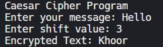

# PRODIGY_CS_01
Python implementation of Caesar Cipher for encryption and decryption as part of Cyber Security Internship at Prodigy Infotech.

---

## 📌 Objective
The objective of this task is to understand and implement the Caesar Cipher algorithm for encrypting and decrypting text. This task helps in learning basic cryptography concepts used in cybersecurity.

Source:  
https://www.britannica.com/topic/Caesar-cipher  

---

## 📖 Introduction
Caesar Cipher is one of the earliest and simplest encryption techniques. It works by shifting each letter in the plaintext by a fixed number of positions in the alphabet.

Although it is not secure by modern standards, it helps beginners understand the fundamentals of encryption and decryption.

Sources:  
https://www.geeksforgeeks.org/caesar-cipher-in-cryptography/  
https://www.cloudflare.com/learning/ssl/what-is-encryption/  

---

## 🔁 How Caesar Cipher Works
- Each alphabet is shifted by a fixed value (key)
- Encryption replaces the original letter with the shifted letter
- Decryption reverses the process using the same key

Example:  
Plain Text: HELLO  
Shift: 3  
Encrypted Text: KHOOR  

---

## 🛠 Tools & Technologies Used
- Python
- GitHub
- Online Python Compiler

Source:  
https://www.python.org/doc/  

---

## 🔍 Steps Performed
1. Studied the Caesar Cipher algorithm
2. Implemented encryption logic using Python
3. Implemented decryption logic using reverse shifting
4. Took user input for message and shift value
5. Tested the program with different inputs

---

## 🧪 Output Screenshots

### Encryption Output

### Decryption Output

---

## 📊 Result
The program successfully encrypts and decrypts text using the Caesar Cipher algorithm based on the user-provided shift value.

---

## 🏁 Conclusion
This task helped in understanding the basics of cryptography and how encryption and decryption work. Caesar Cipher is a foundational concept in cybersecurity and serves as a stepping stone to more advanced encryption techniques.

---

## 📚 References
- Britannica – Caesar Cipher  
  https://www.britannica.com/topic/Caesar-cipher  

- GeeksforGeeks – Caesar Cipher  
  https://www.geeksforgeeks.org/caesar-cipher-in-cryptography/  

- Cloudflare – What is Encryption  
  https://www.cloudflare.com/learning/ssl/what-is-encryption/  
